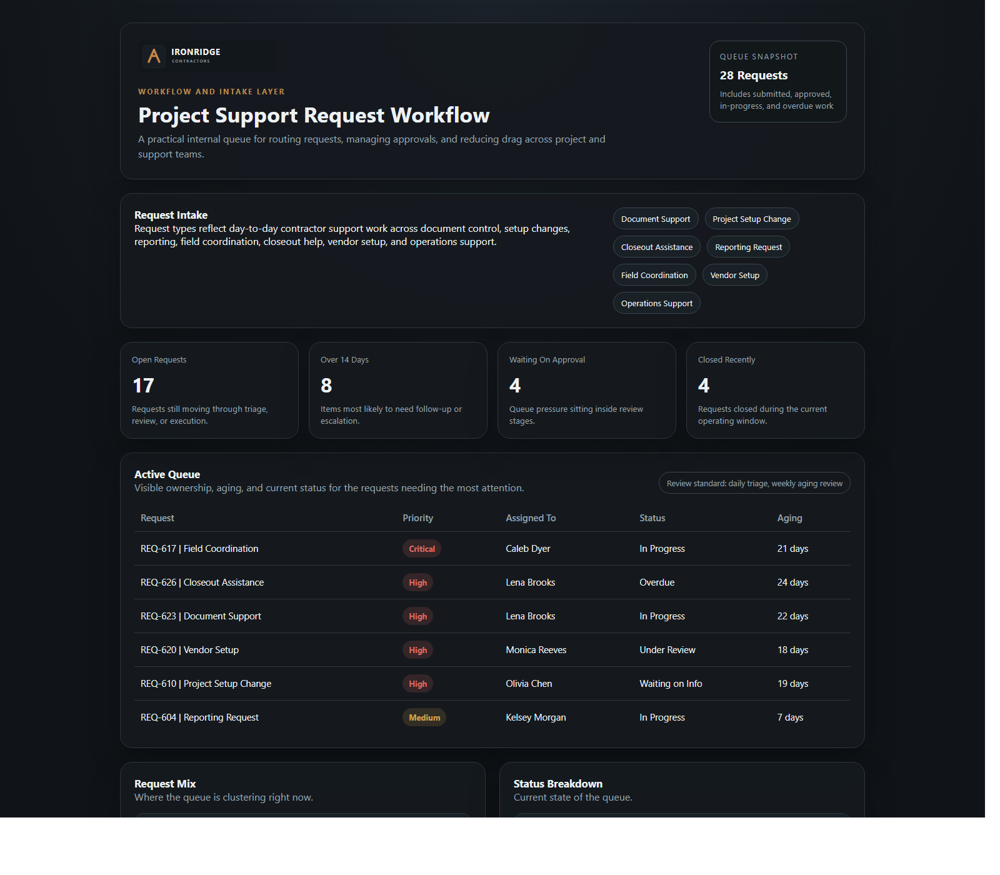
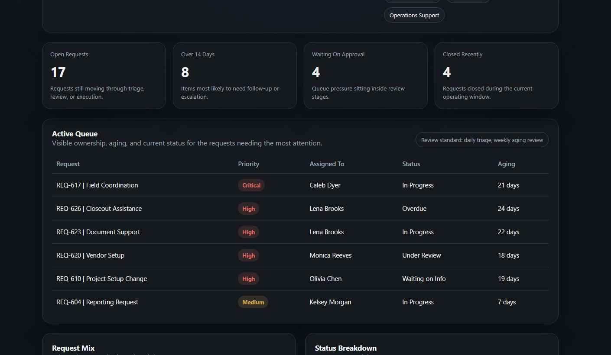

# IronRidge Project Support Request Workflow

## Overview

This repo shows what happens when scattered internal requests stop living in inboxes, side conversations, and personal trackers.

The IronRidge Project Support Request Workflow models a cleaner queue for intake, routing, approvals, assignment, and aging visibility. It is meant to feel practical, not theoretical.

## Business Problem

Project managers and support teams still send real work through inboxes, meeting notes, hallway conversations, and personal trackers. Things slow down when ownership is fuzzy, approvals sit too long, or nobody can see which requests have been aging quietly in the queue.

## What This Repo Adds

This repo models a practical internal request workflow using lightweight seed data, concise docs, and a static queue mock. The emphasis is believable routing logic, visible aging, and a workflow shape that feels like something an operations team would actually use.

## Screenshots

### Overview

### Detail View

## Ecosystem Context

This repo represents the intake and routing layer within the broader IronRidge demo ecosystem. The requests shown here can generate execution commitments tracked in `execution-infrastructure-demo`, may draw on field conditions visible in `contractor-ops-system-demo`, and can ultimately feed reporting demand or volume signals that appear in `ops-visibility-demo`.

## Repository Structure

- `docs/` overview, business context, workflow rules, architecture, diagrams, and ecosystem framing
- `data/raw/` employees, projects, request records, and approval records
- `data/curated/` aging, volume, and status summaries
- `data/sample_exports/` dashboard-ready queue export
- `src/workflow-mock/` static request queue mock for screenshots and walkthroughs
- `assets/` shared visual assets including the IronRidge wordmark
- `notes/` roadmap and screenshot planning

## Data And Sample Assets

The raw layer focuses on request type, ownership, approval stage, current status, and aging. The sample records stay grounded in common contractor support work such as document control, setup changes, reporting requests, field coordination, and closeout help.

## Mock Experience

The mock queue stays intentionally practical: intake context, aging cards, a visible queue, and simple breakdowns by request type and status. It should read like a useful internal operations screen, not a product landing page.

## Example Record Flow

One of the clearest lineage threads in this repo is `REQ-617`, tied to `IR-103 | Riverside Schools Facility Upgrade`.

- A field-driven egress conflict becomes a critical support request instead of living in calls and side conversations.
- The request sits in the queue with visible aging and ownership under Caleb Dyer.
- That same operating pressure continues downstream as `AI-502` in `execution-infrastructure-demo`, `FI-305` in `contractor-ops-system-demo`, and the Riverside watch-list pressure surfaced in `ops-visibility-demo`.

Other linked threads now visible in the queue include `REQ-626` for the Glenpark closeout package and `REQ-624` for Cedar Hill route coverage strain.

## Future Enhancements

- add simple SLA expectations by request type and priority
- expand approval rules for cost, staffing, or client-impacting changes
- add workload and queue views by owner or department
- surface cycle time and approval wait-time reporting

## Fictional Demo Notice

This repository is part of a fictional IronRidge Contractors environment built to show reporting, workflow, execution, and field operations design. The names and records are made up. The operating friction is not.
