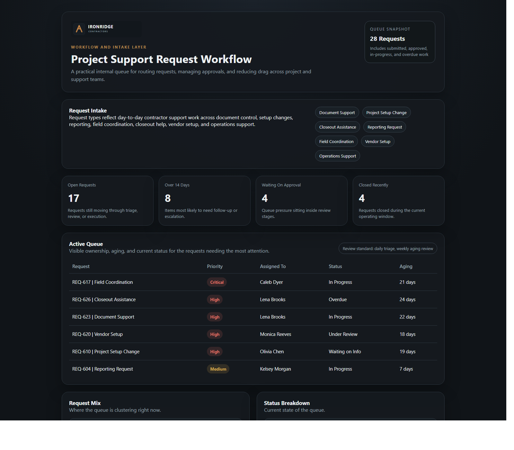
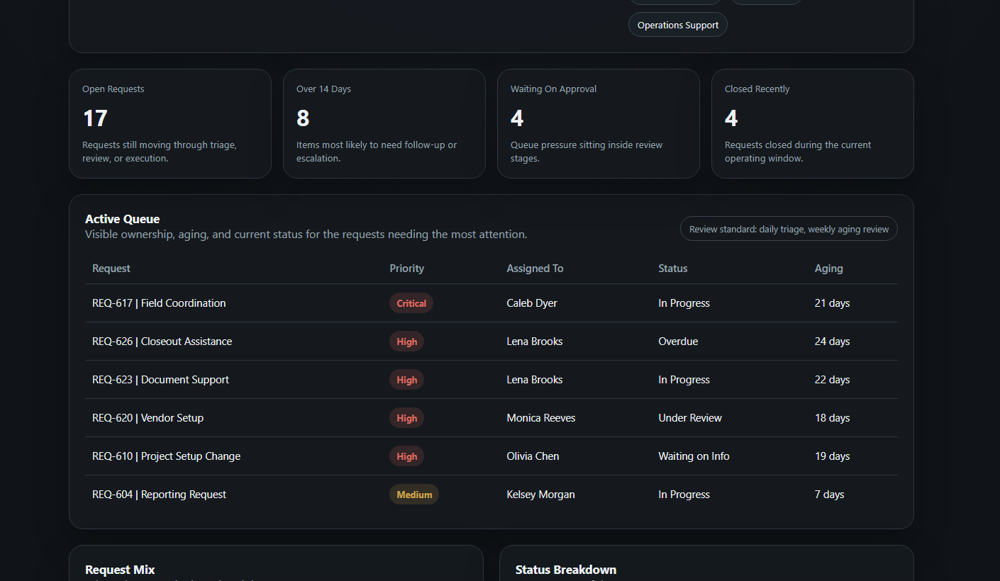

# IronRidge Project Support Request Workflow

Most contractor "systems" for internal requests aren't systems — they're an inbox, a spreadsheet somebody guards, and whoever remembers to follow up. This is a working model of what the intake layer looks like when you actually build it instead of duct-taping it together.

## The problem

IronRidge is a mid-size general contractor. PMs and field staff generate a constant stream of support requests — document control, cost code changes, closeout help, reporting asks — and none of it lives in one place. Ownership goes fuzzy. Approvals stall because nobody can see the queue. A request that should take two days sits for two weeks because nobody's watching how long it's been aging.

## What's actually here

A request queue with real routing logic: intake, approval stage, owner, current status, days aging. It's seeded with data that looks like an actual GC — employees with real titles and reporting lines, active projects with risk flags, requests tied to specific project IDs, approval records with real decision notes attached. Not placeholder names — Riverside Schools, Northgate Medical, Glenpark Retail, the kind of client mix a GC this size actually carries.

## Screenshots

### Overview

### Detail View

## Where this sits in the system

This is the front door. A request that starts here can become a tracked commitment in [`execution-infrastructure-demo`](https://github.com/bdcrouch79/execution-infrastructure-demo), may trace back to a field condition surfaced in [`contractor-ops-system-demo`](https://github.com/bdcrouch79/contractor-ops-system-demo), and eventually shows up as pressure on the leadership dashboard in [`ops-visibility-demo`](https://github.com/bdcrouch79/ops-visibility-demo).

Follow `REQ-617` through all four repos if you want to see the thread end to end: a temporary egress conflict at Riverside Schools turns into a support request here (owned by Caleb Dyer, visibly aging in the queue), an overdue action item in the execution tracker, a severity-rated field issue in the ops tracker, and a watch-list line on the dashboard. Same problem, four vantage points — that's the point of building four repos instead of one. Two more threads run the same path if you want a second example: `REQ-626` (Glenpark closeout) and `REQ-624` (Cedar Hill route coverage).

## Repo layout

- `docs/` — business context, workflow rules, architecture notes, diagrams
- `data/raw/` — employees, projects, requests, approvals
- `data/curated/` — aging and status rollups
- `data/sample_exports/` — a dashboard-ready export
- `src/workflow-mock/` — the queue UI. Plain HTML/CSS/JS, no framework, no build step — open `index.html` and click through it
- `assets/` — shared IronRidge branding
- `notes/` — roadmap

## What I'd build next

- SLA rules by request type and priority
- Approval logic that actually branches on cost or staffing impact
- Owner and department workload views
- Cycle time and approval wait-time reporting

## One note

IronRidge and everyone in this data set are made up. The friction — requests dying in inboxes, approvals nobody can see, aging nobody's tracking — is the part I've actually run into.
